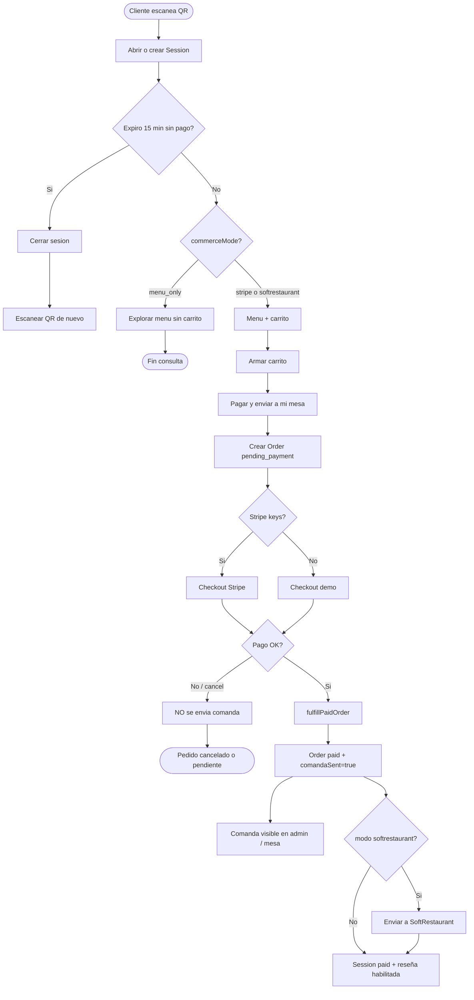
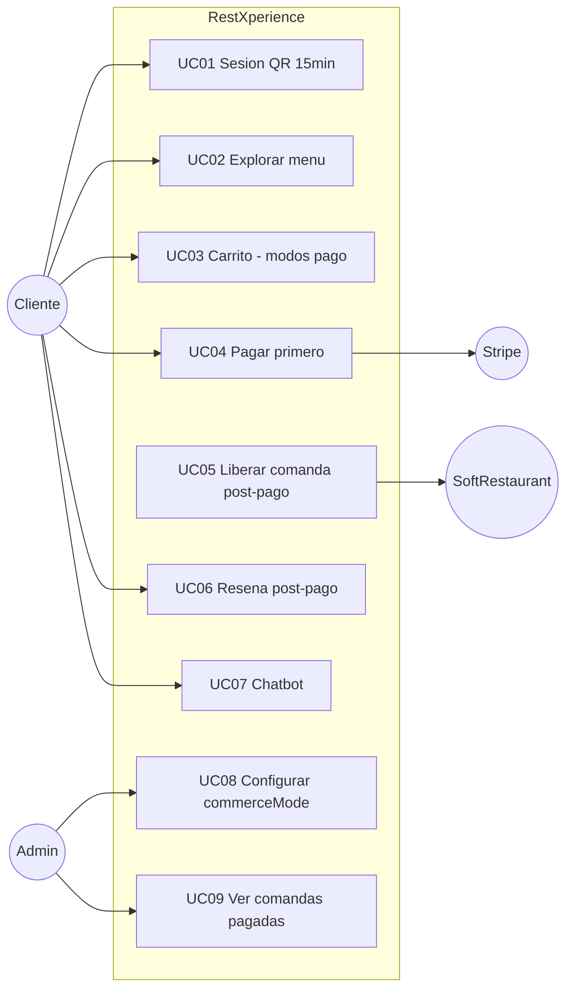

# RestXperience — Plan técnico

> Regla de negocio central: **primero se paga, después se envía la comanda a la mesa**.  
> Sin pago confirmado no hay comanda. Sesión sin concretar: **15 minutos** → se cierra.

---

## 1. Tres modos de comercio

| Modo | Qué ve el cliente | Cuándo sale la comanda |
|------|-------------------|------------------------|
| **stripe** (foco actual) | Menú + carrito + Pagar (Stripe / demo) | Solo tras pago confirmado |
| **softrestaurant** | Igual; cobro + envío POS | Solo tras pago; luego stub/endpoint SoftRestaurant |
| **menu_only** | Solo catálogo visual | Nunca (sin carrito ni pedidos) |

Default del seed: **`stripe`**.

---

## 2. Diagrama de flujo (pago primero)



---

## 3. Casos de uso (actualizados)



---

## 4. Blueprint — estados de Order

```
pending_payment  →  (pago OK)  →  paid + comandaSent=true
                 →  (cancel)   →  cancelled   [nunca hubo comanda]
```

**Sesión**
- `open` + `expiresAt` = now + 15 min (se renueva con actividad mientras no expire)
- Sin pago en 15 min → `closed`
- Tras pago → `paid` (habilita reseña)

---

## 5. Archivos clave del flujo de pago

| Archivo | Rol |
|---------|-----|
| `src/lib/commerce.ts` | Modos + TTL 15 min |
| `src/lib/session.ts` | Crear/renovar/expirar sesión |
| `src/lib/stripe.ts` | Checkout Stripe o demo |
| `src/lib/fulfill.ts` | **Único** lugar que marca pago y suelta comanda |
| `src/app/api/orders/route.ts` | Crea `pending_payment` + URL checkout |
| `src/app/api/checkout/confirm/route.ts` | Confirma pago → fulfill |
| `/mesa/[token]/pago` | Return URL post-Stripe/demo |

---

## 6. SoftRestaurant (pendiente de params)

Por ahora stub en `src/lib/softrestaurant.ts`. Cuando tengas el contrato Open API / params, se conecta el endpoint en admin. La regla no cambia: **solo se llama después del pago**.
