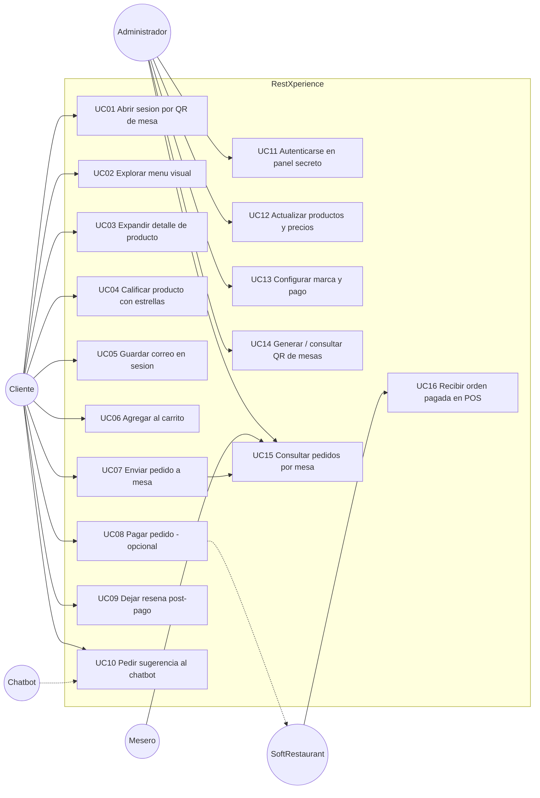
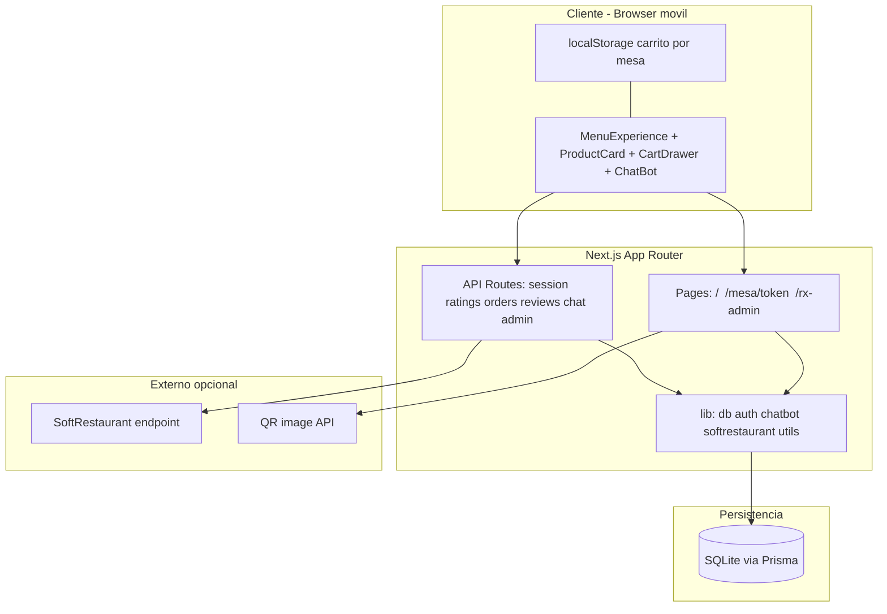
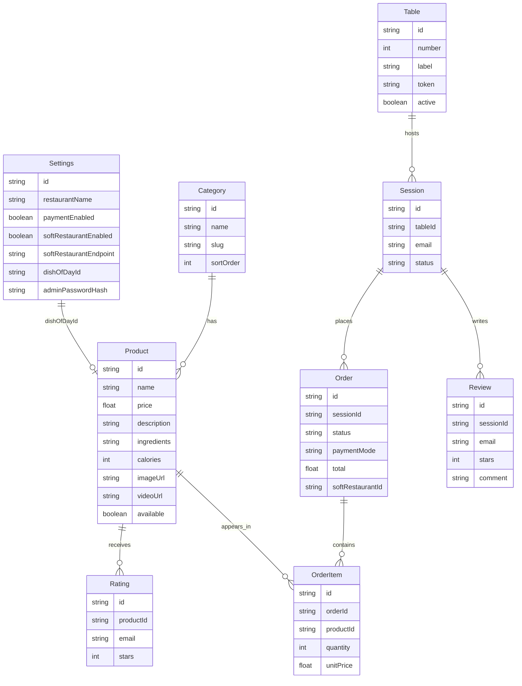

# RestXperience — Plan técnico (post-implementación)

> Nota: este documento describe el sistema **tal como quedó implementado** en el repo. Sirve como plan de referencia, diagrama de flujo, casos de uso y blueprint detallado.

---

## 1. Resumen del producto

**RestXperience** es un menú digital visual, mobile-first, pensado para restaurantes (marca genérica adaptable). El cliente escanea un QR en su mesa, abre una sesión, explora el menú con media expandible, agrega al carrito, puede pedir (y opcionalmente pagar), calificar productos, dejar reseña con correo y recibir ayuda de un chatbot cálido.

El **módulo de pago es conmutable**: si el local solo quiere menú + pedidos a mesa, el pago queda apagado. Si usan SoftRestaurant (u otro POS), se activa y se vincula por endpoint.

---

## 2. Actores

| Actor | Descripción |
|-------|-------------|
| **Cliente** | Comensal en mesa; usa el menú vía QR |
| **Mesero / cocina** | Consume pedidos desde el panel (y POS si está activo) |
| **Administrador** | Gestiona catálogo, precios, mesas/QR, settings y pago |
| **Chatbot** | Asistente de sugerencias (comida del día, cortes, etc.) |
| **SoftRestaurant (opcional)** | Sistema de ventas externo receptor de órdenes pagadas |

---

## 3. Diagrama de flujo

Flujo principal del cliente (sesión mesa → pedido → pago opcional → reseña) y ramas admin / SoftRestaurant.

```mermaid
flowchart TD
  start([Cliente llega al restaurante]) --> scan[Escanea QR de la mesa]
  scan --> openSession[Abrir /mesa/token]
  openSession --> createSession{Sesion abierta existe?}
  createSession -->|No| newSession[Crear Session status=open]
  createSession -->|Si| reuseSession[Reutilizar Session]
  newSession --> menu
  reuseSession --> menu[Ver menu visual por categorias]

  menu --> browse[Explorar productos]
  browse --> expand[Tap: expandir detalle]
  expand --> detail[Foto/video + descripcion + ingredientes + calorias]
  detail --> rateOpt{Quiere calificar?}
  rateOpt -->|Si y tiene email| rateAPI[POST /api/ratings]
  rateOpt -->|No| addCart
  rateAPI --> addCart

  browse --> chat[Abrir chatbot]
  chat --> chatAPI[POST /api/chat]
  chatAPI --> suggest[Sugerencia + comida del dia]
  suggest --> browse

  browse --> emailSave[Opcional: guardar correo en sesion]
  emailSave --> patchSession[PATCH /api/session]
  patchSession --> browse

  browse --> addCart[Agregar al carrito]
  addCart --> cart[Abrir carrito]

  cart --> sendOrder[Enviar pedido a mi mesa]
  sendOrder --> orderAPI[POST /api/orders pay=false]
  orderAPI --> orderSent[Order status=sent]
  orderSent --> adminSees[Visible en /rx-admin Pedidos]

  cart --> payCheck{paymentEnabled?}
  payCheck -->|No| hidePay[Ocultar boton Pagar ahora]
  payCheck -->|Si| payNow[Pagar ahora]
  payNow --> orderPay[POST /api/orders pay=true]
  orderPay --> srCheck{softRestaurantEnabled?}
  srCheck -->|Si| srSend[sendToSoftRestaurant]
  srCheck -->|No| simPay[Pago simulado SR-SIM]
  srSend --> orderPaid[Order status=paid]
  simPay --> orderPaid
  orderPaid --> sessionPaid[Session status=paid]
  sessionPaid --> reviewUnlock[Habilitar panel de resena]
  reviewUnlock --> reviewAPI[POST /api/reviews]
  reviewAPI --> endHappy([Fin experiencia])

  orderSent --> endAsk([Esperar comida / seguir pidiendo])

  subgraph adminFlow [Panel secreto]
    adminLogin[POST /api/admin/login] --> adminPanel[/rx-admin]
    adminPanel --> editProducts[Editar precios media disponibilidad]
    adminPanel --> editSettings[Toggle pago SoftRestaurant comida del dia]
    adminPanel --> tablesQR[Ver mesas y QR]
    adminPanel --> viewOrders[Ver pedidos por mesa]
  end
```

---

## 4. Diagrama de casos de uso



### Catálogo de casos de uso (detalle)

| ID | Caso de uso | Actor | Precondición | Resultado |
|----|-------------|-------|--------------|-----------|
| UC01 | Abrir sesión por QR | Cliente | Mesa activa con `token` | Session `open` ligada a Table |
| UC02 | Explorar menú | Cliente | Sesión válida | Lista por categorías, solo `available` |
| UC03 | Expandir detalle | Cliente | Producto visible | Muestra descripción, ingredientes, calorías, media |
| UC04 | Calificar con estrellas | Cliente | Email en sesión | Rating 1–5 (upsert por producto+email) |
| UC05 | Guardar correo | Cliente | Email válido | `Session.email` actualizado |
| UC06 | Agregar al carrito | Cliente | — | Línea en localStorage por mesa |
| UC07 | Enviar pedido | Cliente | Carrito no vacío | Order `sent`, items snapshot, visible en admin |
| UC08 | Pagar pedido | Cliente | `paymentEnabled=true` | Order `paid`; opcional envío SoftRestaurant |
| UC09 | Dejar reseña | Cliente | Sesión/orden `paid` + email | Review persistida |
| UC10 | Chatbot | Cliente | — | Respuesta con comida del día / categorías |
| UC11 | Login admin | Admin | Password hash en Settings | Cookie `rx_admin` |
| UC12 | CRUD precios/media | Admin | Autenticado | Productos actualizados en menú en vivo |
| UC13 | Config marca/pago | Admin | Autenticado | Toggles pago + SoftRestaurant + dishOfDay |
| UC14 | QR mesas | Admin | Autenticado | URL `/mesa/{token}` + QR imprimible |
| UC15 | Ver pedidos | Admin/Mesero | Autenticado | Lista por mesa, total, items, modo pago |
| UC16 | Recibir en POS | SoftRestaurant | Endpoint o stub | `softRestaurantId` en Order |

---

## 5. Blueprint detallado

### 5.1 Arquitectura de capas



### 5.2 Mapa de rutas

| Ruta | Tipo | Responsabilidad |
|------|------|-----------------|
| `/` | Page | Landing + accesos demo a mesas 1–12 |
| `/mesa/[token]` | Page | Sesión de mesa + menú completo |
| `/rx-admin` | Page | Panel secreto (login + tabs) |
| `POST /api/session` | API | Guardar email en sesión |
| `POST /api/ratings` | API | Estrellas por producto+email |
| `POST /api/orders` | API | Crear pedido; rama pago |
| `POST /api/reviews` | API | Reseña post-pago |
| `POST /api/chat` | API | Respuesta del anfitrión/chatbot |
| `GET/POST/DELETE /api/admin/login` | API | Auth cookie admin |
| `GET/PATCH /api/admin/data` | API | Settings, productos, mesas, pedidos |

### 5.3 Modelo de datos (Prisma)



### 5.4 Módulos funcionales (blueprint por feature)

#### A. Experiencia visual del menú
- **UI**: `MenuExperience`, `ProductCard`, `globals.css` (glass / liquid crystal)
- **Comportamiento**: categorías sticky, cards full-bleed de media, expand on tap, CTA Agregar
- **Media**: `imageUrl` / `videoUrl` opcionales; placeholder hasta cargar assets

#### B. Sesión por mesa (QR)
- Cada `Table` tiene `token` único (`nanoid`)
- URL canónica: `/mesa/{token}`
- Al entrar: busca Session open/paid o crea una nueva
- Admin genera QR apuntando a esa URL (imprimible por mesa)

#### C. Carrito y pedido
- Estado cliente en `CartProvider` (localStorage key `rx-cart-{token}`)
- `POST /api/orders` con `pay: false` → `status=sent`, `paymentMode=none`
- Snapshot de nombre/precio en `OrderItem` (histórico estable aunque cambie el menú)

#### D. Módulo de pago (feature flag)
- `Settings.paymentEnabled` controla visibilidad de “Pagar ahora”
- Si `pay: true` y flag off → 400
- `paymentMode`: `none` | `simulated` | `softrestaurant`
- Adapter: `src/lib/softrestaurant.ts` (stub log + fetch opcional al endpoint)

#### E. Correo, ratings y reseñas
- Email opcional en sesión (habilita ratings y reseña)
- Rating: único por `(productId, email)`
- Review: solo si `Order.status=paid` o `Session.status=paid`

#### F. Chatbot
- Reglas en `src/lib/chatbot.ts` (sin LLM externo por ahora)
- Usa `dishOfDayId` + sample del menú
- Tono cálido de recepción; sugiere comida del día, cortes, entradas, etc.

#### G. Panel secreto
- Ruta no obvia: `/rx-admin`
- Auth: bcrypt password + cookie httpOnly
- Tabs: Pedidos | Productos | Mesas/QR | Configuración (marca + toggles pago)

### 5.5 Decisiones de diseño ya tomadas

| Tema | Decisión |
|------|----------|
| Framework | Next.js App Router + TypeScript + Tailwind 4 |
| DB | SQLite + Prisma 5 (simple para arrancar; migrable a Postgres) |
| Estética | Liquid crystal / glass, tonos carbón + acento champagne (sin saturación fuerte) |
| Marca | Genérica `RestXperience`, editable en admin |
| Catálogo inicial | Seed del CSV completo (~120 ítems) |
| Pago | Apagado por defecto; SoftRestaurant como integración futura activable |
| Chatbot | Rule-based v1 (barato, predecible); upgrade a LLM posible después |
| Carrito | Client-side hasta checkout (rápido en móvil) |

### 5.6 Estructura de archivos clave

```
src/
  app/
    page.tsx                 # Landing + mesas demo
    mesa/[token]/page.tsx    # Sesión cliente
    rx-admin/page.tsx        # Panel secreto
    api/...                  # Endpoints
  components/
    menu-experience.tsx      # Orquestador UI mesa
    product-card.tsx
    cart-drawer.tsx
    chat-bot.tsx
    admin-panel.tsx
  lib/
    db.ts / auth.ts / chatbot.ts / softrestaurant.ts
prisma/
  schema.prisma
  menu-data.ts / seed.ts
```

### 5.7 Estados de dominio

**Session.status**: `open` → `paid` → `closed` (closed reservado)

**Order.status**: `pending` | `sent` | `paid` | `cancelled`

**Order.paymentMode**: `none` | `simulated` | `softrestaurant`

### 5.8 Roadmap lógico (si se itera)

1. Carga de imágenes/videos reales por producto
2. Deploy (Vercel + Postgres si se necesita multi-instancia)
3. SoftRestaurant: contrato real de API + reintentos + cola
4. Roles mesero (solo pedidos) vs admin (catálogo)
5. Chatbot con LLM + menú como contexto RAG
6. Impresión de QRs en lote (PDF)

---

## 6. Cómo validar el flujo

1. `npm run dev` → `/` → entrar Mesa 1  
2. Expandir producto, agregar al carrito, enviar pedido  
3. `/rx-admin` (pass `restx-admin`) → ver pedido  
4. Config → activar pago → en mesa usar “Pagar ahora”  
5. Tras pago, dejar reseña con correo  
6. Chatbot: “¿qué hay de comida del día?”
